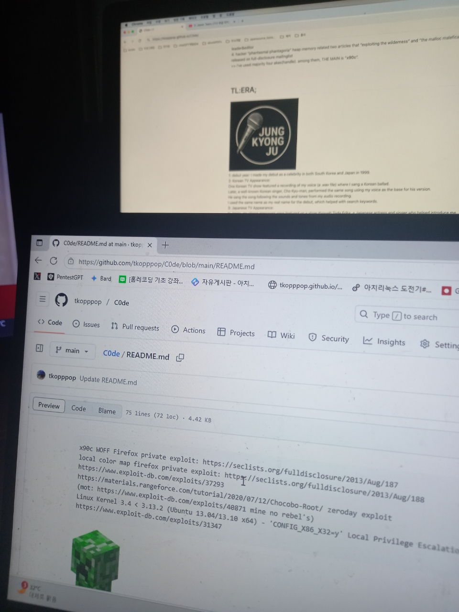

<pre>
x90c WOFF Firefox private exploit: https://seclists.org/fulldisclosure/2013/Aug/187
local color map firefox private exploit: https://seclists.org/fulldisclosure/2013/Aug/188
https://www.exploit-db.com/exploits/37293
https://materials.rangeforce.com/tutorial/2020/07/12/Chocobo-Root/ zeroday exploit
(mot: https://www.exploit-db.com/exploits/40871 mine no rebel's)
Linux Kernel 3.4 < 3.13.2 (Ubuntu 13.04/13.10 x64) - 'CONFIG_X86_X32=y' Local Privilege Escalation (3):
https://www.exploit-db.com/exploits/31347
</pre>
 
# TL:DR;
1: hacker "tf8" made format string bug practical place holder. first place theory 1989. and then 1994~research starting and end 1999-2001. Full-disclosure mailinglist, hack.co.za activating!!! 
2: "lamagra argamal" for spreading my format string bug(fsb) technique 
3: hacker "x90c" made korean underground hacker activities and USA underground free hacker magazine phrack's (7 - TCLH) team leader&editor 
4: hacker "phantasmal phantagoria" heap memory related two articles that "exploiting the wilderness" and "the malloc maleficarum"  released
on full-disclosure mailinglist 
=> i've used majority four akas(handle). among them, THE MAIN is "**x90c**".   
# TL:ERA;
 
1: debut year: I made my debut as a celebrity in both South Korea and Japan in 1999. 
2: Korean TV Appearance: 
One Korean TV show featured a recording of my voice (a .wav file, title: "i'll give you all") where I sang a Korean ballad i made 
Later, a well-known Korean singer, Cho Kyu-man, performed the same song using my voice as the base for his version. 
He sang the song following the sounds and tones from my audio recording. 
I used the same name as my real name for the debut, which helped with search keywords. 
3: Japanese TV Appearance: 
In Japan, my phone messages were featured on a show through Toda Erika, a Japanese actress and singer who helped introduce me via her entertainment manager. 
4: Chinese Media Feature: 
My debut was also shown in a Chinese hacker-themed magazine, although that publication is now lost. 
5: Debut Style: 
I debuted through three creative formats—TV broadcast, music, and print media—like a producer and a creator-style artist. 
     
# TE:LE;
I lost your phone number.
It's too old school. and nerd hacker. i started producing it myself 'hacker to talent singer(celebrity)'.

# gmail 
x90cx90c1@gmail.com (secretly received yours mail box inbox) 

<pre>
-----BEGIN PGP PUBLIC KEY BLOCK-----

mQSuBGhnlhYRDADKJECQsY6vmKIVIkACZc3wdFsByi0TPZwK1u+d1fZQsJi9l9Rx
U5vFPjJxn7UISG4Nu3XoFmky5t1P4H+Y0D+YWIiS8Q/UzDf7ltevgCoQAQlay3bk
Z1IZxxr2+CrOME6oTyyBHF4RPzPgVxtEurFsNQh/l8uaqDPH68M90Z0QBnce9Exn
HGTTdRPoBGngD1tJceR79eKoNUo6s3rsas+3pMZTuHuxawgqo4bLqWbf2R7avnlm
8DavEOmH8NVig6VlNzzJu+SlanUJtMylz5zYu2/hO4c9PW6TdfDHuoreIuUvcVKK
fbJ8kVtBY7s1UgOGQzJ+Zg92p8V2649ikmJSgeEKfttMSwCxxxmy773Hezlb1B7Y
OvGNXX52Yxqs1pv9tWmxzyq+zjjYYZ5mrGBPtKmgOPGTGE4D0SCEFk+CnE7gCs+h
aKqq5IYMfvwzLkr/jP/dknmQPm2YicB5BfoeV62V5lWMSVj3FL4MXCCA6opkGTH7
ejANaawwQNZfYN8BANRnf8UzpUmbJ6WLdz2OUcODu3dT8CDKH5vLfYqR7vwpC/95
Jwzm8ZrE4lTLHinTc4NwayLBPWC1UColBkg69Fl6UEIIZBYNlu9LPJhVUtE0Wbhx
jN4Ba286SQz3cbz+tLaMcWnOHk51AUG1bas2HymCClG6NQOc+IEGutZikM0FTxiJ
eGDZFLx4MUf6s1GV08vZnimxj71TGGKKuCZLTz2Mb2fTNklWQgEKbseeM40UOMhQ
K1NQ0QYTMXoq7d0epRGFVpW2WNjHpa+5ey0jzHR+diHfDfsVAT1WVzzl88UeHyzm
VuaqqaRvrku9dxSgyb4mQtaV5YwbMoUHZyIIhtn24k8plJaElVKPpQtoDCKnblhB
So0hO9ymbnhXEI/At3w0S6rYOaegP9ERcrLpcXt32oOZqGTQ/A92eX+7WatZLiPb
NIOxdTTp5bYihEl1l0TBysZ4BxnWRSPbJ+gLRvrfeX0BVHF+U//eL/AupsNOhPMA
G2+qhb5VPAVv38vDMU/Fvj0vd37ha2YyidklKcCDUE42Z99rnWHJq5uOZa/p6ncL
/3Aab7FfUOrQDyaAH63A/37DMWxsiigdIYMzoxgXoyfd0O5Jb97BZkyImdeaEpGy
yX7GNRH1X0alYMt7uPMAlpQ7lXxIMtIq8RmCjOQkVp4MHTyeRMBNSdcimYtegjhm
atQ12R6UzYUGDVez2gXJTFLKFJlXCXM2oAydLjY9QzkI+ufY8GOu+0DtQpKS905S
6Q0ZlCesCKkJipgbu8GrNXwYxBGRaDNEuKEHFM49Ly4bgxC4t88pUr9RrEJlpsGz
EYbT/bHt0Y+yZxXtyT2M0tPREY6QAPSoYIaqS12KG9+KAIycHDtqEYP5/taGn2+m
4zCq/itF/hoNoaYcFgiwH9SU8SR2yHYHd2bFMFS1K9pOKW+x7r7ETQpk68jAO1DX
ig+4yI2XQLSKBGDS94iuEGWoI6WLeUVcmxvjro4AU+3Y/5uK0UrFULdhd7onLgi0
csfhQm5NG19NeNXSrdZ5vsv2PT8nRcpYzyRtkFmGFwBPZ0Yz+JspmvdUxNR92gyC
frQ2S3lvbmdKdUp1bmcgKExpbnV4S2VybmVsSEFDS0VSMSkgPHg5MGN4OTBjMUBn
bWFpbC5jb20+iJYEExEIAD4WIQTVViXr3wYljHzk/P+7ai2YamzEaAUCaGeWFgIb
AwUJEswDAAULCQgHAgYVCgkICwIEFgIDAQIeAQIXgAAKCRC7ai2YamzEaOxKAP9j
q/yf+iLO+IAkySce7bAEHNTHEzocLGADD0Q1Xs/GzwEAtJPTOEKUUZ1sqvWWJKIu
M8iPnDhZnqM2lt91ItHWk4Q=
=64UM
-----END PGP PUBLIC KEY BLOCK-----
</pre>
